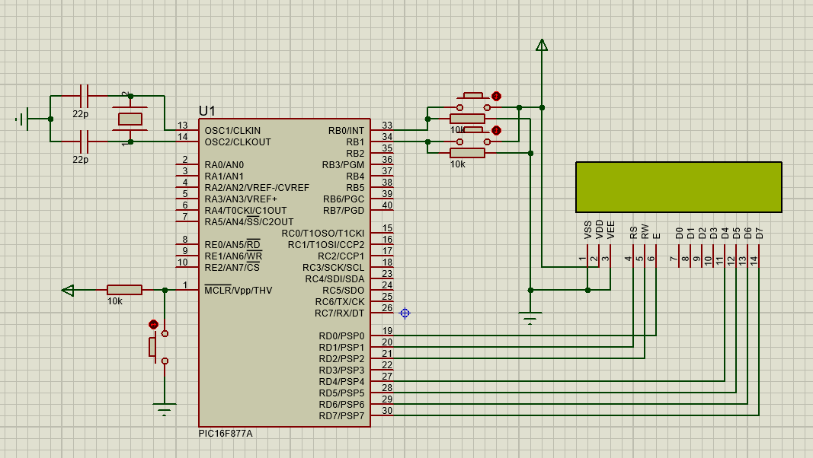

# `PIC16F877A` Reloj Digital

Este proyecto utiliza un microcontrolador PIC16F877A para crear un Reloj Digital, el Reloj se muestra en una pantalla LCD y se puede modificar tanto las horas, minutos y segundos.

## Componentes
- Microcontrolador: PIC16F877A
- Pantalla LCD
- 2 Botones 

## Herramientas de Desarrollo
- Proteus 11 para la simulación
- Lenguaje de programación: C

## Archivos del Proyecto
- `Código fuente` : "Digital_Clock.c"
- Archivo .hex para la programación del microcontrolador.
- Archivo .cof para depuración.

## Diagrama de Conexión
- Se incluye una imagen PNG que muestra el diagrama de conexión entre los componentes.
- Tambien se añade la simulacion realizada en Proteus.

## Licencia
Este proyecto está bajo la licencia MIT. Consulta el archivo `LICENSE` para obtener más detalles.

-------------------------------

# `PIC16F877A` Digital Clock

This project uses a PIC16F877A microcontroller to create a Digital Clock. The clock is displayed on an LCD screen and the hours, minutes, and seconds can be modified.

## Components
- Microcontroller: PIC16F877A
- LCD Screen
- 2 Buttons

## Development tools
- Proteus 11 for simulation
- Programming language: C

## Project files
- `Source code` : “Digital_Clock.c”
- .hex file for microcontroller programming
- .cof file for debugging

## Connection diagram
- A PNG image is included showing the connection diagram between the components.
- The simulation carried out in Proteus was also added.

## License
This project is under the MIT license. See the `LICENSE` file for more details.

-------------------------------

 

